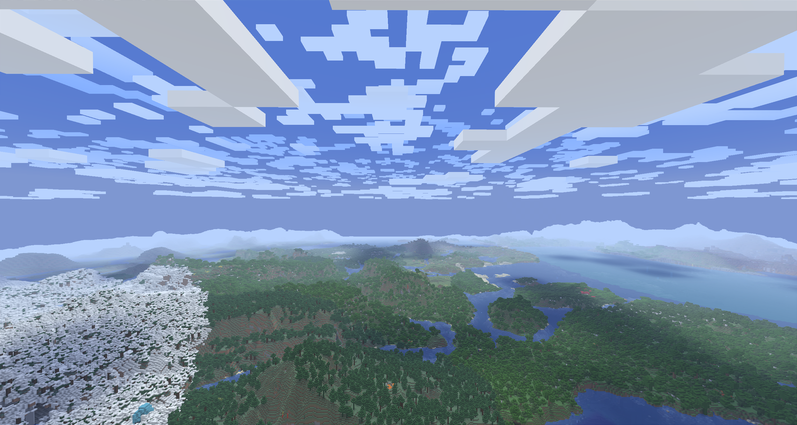

# Better Cloud Shadows

Better Cloud Shadows is an extremely simple mod that casts subtle moving shadows beneath clouds.

Shadows fade out near sunrise and sunset, while it is raining, and with distance.

Heavily inspired by the (tragically unreleased) [cloud mod by cappin](https://www.youtube.com/watch?v=j306UFAPgDE).

**High render distances or mods like [Voxy](https://modrinth.com/mod/voxy)/[Distant Horizons](https://modrinth.com/mod/distanthorizons) are recommended!**

### Dependencies

- **[Better Clouds](https://modrinth.com/mod/better-clouds) (optional)**: Casts cloud shadows under their clouds.
- **[Cloud Layers](https://modrinth.com/mod/cloud-layers) (optional)**: Casts cloud shadows under each of their cloud
  layers.
- **[Distant Horizons](https://modrinth.com/mod/distanthorizons) (optional)**: Casts cloud shadows in LOD chunks.
- **[YACL](https://modrinth.com/mod/yacl)/[Mod Menu](https://modrinth.com/mod/modmenu) (optional)**: Adds an in-game
  config screen.

## License

---

 
